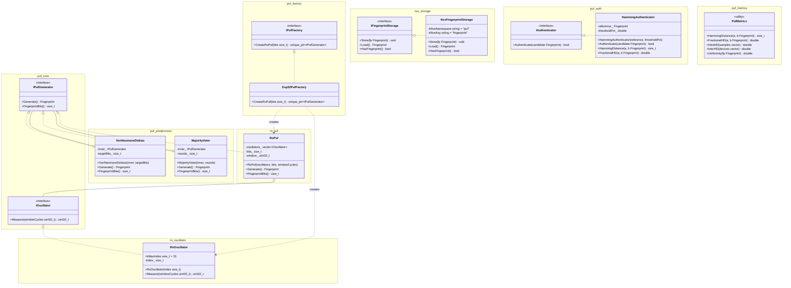

# puf_generator

Аппаратный идентификатор устройства на основе Ring Oscillator PUF для ESP32.  
Генерирует 256-битный отпечаток, уникальный для каждого экземпляра чипа,
на основе вариаций времени выполнения программных осцилляторов в IRAM.

---

## Архитектура



### Компоненты

| Компонент | Зависимости | Описание |
|---|---|---|
| `puf_core` | — | Интерфейсы `IOscillator`, `IPufGenerator`, тип `Fingerprint` |
| `ro_oscillator` | `puf_core` | 32 IRAM-осциллятора для ESP32 (Xtensa LX6) |
| `ro_puf` | `puf_core` | Генератор отпечатка попарным сравнением счётчиков; платформонезависим |
| `puf_factory` | `puf_core`, `ro_oscillator`, `ro_puf` | Интерфейс `IPufFactory` и реализация `Esp32PufFactory` |
| `nvs_storage` | `puf_core` | Хранение эталонного отпечатка в ESP32 NVS |
| `puf_auth` | `puf_core` | Аутентификация по расстоянию Хэмминга с настраиваемым порогом |
| `puf_postprocess` | `puf_core` | Декораторы `VonNeumannDebias` и `MajorityVoter` для повышения качества |
| `puf_metrics` | `puf_core` | Метрики оценки PUF: intra-HD, inter-HD, uniformity |

Новый тип устройства — новая фабрика. Новый тип осциллятора — новый компонент рядом с `ro_oscillator`. Постобработка подключается декораторами без изменения генератора.

---

## Структура проекта

```
puf_generator/
├── conanfile.py
├── cmake/
│   └── ctest_cmake.txt        # puf_add_test() + PUF_BUILD_TESTS флаг
├── profiles/
│   ├── esp32                  # Conan-профиль для кросс-компиляции
│   └── host                   # Conan-профиль для хост-тестов
├── components/
│   ├── puf_core/
│   │   ├── fingerprint.hpp
│   │   ├── i_oscillator.hpp
│   │   ├── i_puf_generator.hpp
│   │   └── CMakeLists.txt
│   ├── ro_oscillator/
│   │   ├── ro_oscillator.hpp
│   │   ├── CMakeLists.txt
│   │   └── src/ro_oscillator.cpp
│   ├── ro_puf/
│   │   ├── ro_puf.hpp
│   │   ├── CMakeLists.txt
│   │   ├── src/ro_puf.cpp
│   │   └── test/
│   │       ├── mock_oscillator.hpp
│   │       └── ro_puf_test.cpp
│   ├── puf_factory/
│   │   ├── ipuf_factory.hpp
│   │   ├── esp32_puf_factory.hpp
│   │   ├── CMakeLists.txt
│   │   └── src/esp32_puf_factory.cpp
│   ├── nvs_storage/
│   │   ├── i_fingerprint_storage.hpp
│   │   ├── nvs_fingerprint_storage.hpp
│   │   ├── CMakeLists.txt
│   │   └── src/nvs_fingerprint_storage.cpp
│   ├── puf_auth/
│   │   ├── i_authenticator.hpp
│   │   ├── hamming_authenticator.hpp
│   │   ├── CMakeLists.txt
│   │   └── src/hamming_authenticator.cpp
│   ├── puf_postprocess/
│   │   ├── von_neumann_debias.hpp
│   │   ├── majority_voter.hpp
│   │   ├── CMakeLists.txt
│   │   └── src/
│   │       ├── von_neumann_debias.cpp
│   │       └── majority_voter.cpp
│   └── puf_metrics/
│       ├── puf_metrics.hpp
│       ├── CMakeLists.txt
│       └── src/puf_metrics.cpp
└── main/
    ├── main.cpp
    ├── Kconfig.projbuild
    └── CMakeLists.txt
```

---

## Требования

- [ESP-IDF](https://docs.espressif.com/projects/esp-idf/en/latest/esp32/get-started/) v5.x
- [Conan](https://conan.io/) 2.x (`pip install conan`)
- CMake 3.16+
- [Doxygen](https://www.doxygen.nl/) 1.9+ (для генерации документации)

---

## Документация

```bash
doxygen Doxyfile
# HTML-документация генерируется в docs/html/index.html
```

---

## Сборка

### ESP32

#### Установка ESP-IDF

```bash
git clone --recursive --depth 1 --branch v5.4.1 https://github.com/espressif/esp-idf.git ~/esp/esp-idf
cd ~/esp/esp-idf && ./install.sh esp32
```

> `install.sh` must be run before `export.sh`. Re-run it after any ESP-IDF update or if `export.sh` reports missing Python dependencies.

#### Прошивка

```bash
# Activate environment (required in every new terminal)
. ~/esp/esp-idf/export.sh

idf.py set-target esp32

# Linux: /dev/ttyUSB0, macOS: /dev/cu.usbmodem101
idf.py -p /dev/cu.usbmodem101 flash monitor
```

#### Автоматизация (scripts/flash.py)

```bash
# Auto-detect port, install IDF if missing, build and flash
python3 scripts/flash.py

# Explicit port
python3 scripts/flash.py --port /dev/cu.usbmodem101

# Build only
python3 scripts/flash.py --build-only
```

> Requires Python 3.9+. The script clones and installs ESP-IDF automatically on first run.

### Конфигурация (menuconfig)

```bash
idf.py menuconfig   # PUF Generator → длина отпечатка, окно, число раундов
```

| Параметр | По умолчанию | Описание |
|---|---|---|
| `PUF_FINGERPRINT_BITS` | 256 | Длина отпечатка в битах (64–496) |
| `PUF_WINDOW_CYCLES` | 200 000 | Окно измерения в тактах CPU |
| `PUF_MAJORITY_ROUNDS` | 3 | Число раундов голосования (нечётное) |

### Хост-тесты (через Conan)

```bash
# Сгенерировать хост-профиль (один раз)
conan profile detect --name host

# Установить зависимости и настроить сборку
conan install . --output-folder=build_host --build=missing -pr=profiles/host

# Собрать и запустить тесты
cmake -B build_host -DCMAKE_TOOLCHAIN_FILE=build_host/conan_toolchain.cmake \
      -DPUF_BUILD_TESTS=ON
cmake --build build_host
ctest --test-dir build_host --output-on-failure
```

---

## Использование

### Базовый отпечаток

```cpp
#include <esp32_puf_factory.hpp>

puf::Esp32PufFactory factory;
const auto generator = factory.CreateRoPuf(256);
const puf::Fingerprint fp = generator->Generate();
// fp — std::vector<uint8_t>, 32 байта (256 бит)
```

### С постобработкой

```cpp
#include <esp32_puf_factory.hpp>
#include <majority_voter.hpp>
#include <von_neumann_debias.hpp>

puf::Esp32PufFactory factory;
auto raw = factory.CreateRoPuf(512);

// Стабилизация голосованием большинством (3 измерения)
auto stable = std::make_unique<puf::MajorityVoter>(std::move(raw), 3);

// Устранение смещения методом фон Неймана
auto debiased = std::make_unique<puf::VonNeumannDebias>(std::move(stable), 256);

const puf::Fingerprint fp = debiased->Generate();
```

### Хранение и аутентификация

```cpp
#include <nvs_fingerprint_storage.hpp>
#include <hamming_authenticator.hpp>

puf::NvsFingerprintStorage storage;

// Энролмент (один раз при производстве)
if (!storage.HasFingerprint()) {
    storage.Store(fp);
}

// Аутентификация (порог 10% intra-HD)
puf::HammingAuthenticator auth(storage.Load(), 10.0);
const bool ok = auth.Authenticate(fp);
```

### Принцип генерации отпечатка

1. `Esp32PufFactory` создаёт N экземпляров `RoOscillator` (N×(N−1)/2 пар ≥ bits).
2. `RoPuf::Generate()` запускает каждый осциллятор на `windowCycles` тактов.
3. Для каждой пары `(i, j)`: `counts[i] > counts[j]` → бит `1`, иначе `0`.
4. Результат — `ceil(bits/8)` байт, уникальных для данного экземпляра чипа.

---

## Метрики оценки (`puf_metrics`)

| Метрика | Идеал | Описание |
|---|---|---|
| `IntraHD` | 0.0 | Среднее HD между повторными измерениями одного устройства (цель: < 5%) |
| `InterHD` | 0.5 | Среднее HD между отпечатками разных устройств (максимальная различимость) |
| `Uniformity` | 0.5 | Доля единичных бит (равномерность распределения) |

```cpp
#include <puf_metrics.hpp>

const double intra = puf::metrics::IntraHD({fp1, fp2, fp3});
const double inter = puf::metrics::InterHD({fpDevice1, fpDevice2});
const double uni   = puf::metrics::Uniformity(fp);
```
