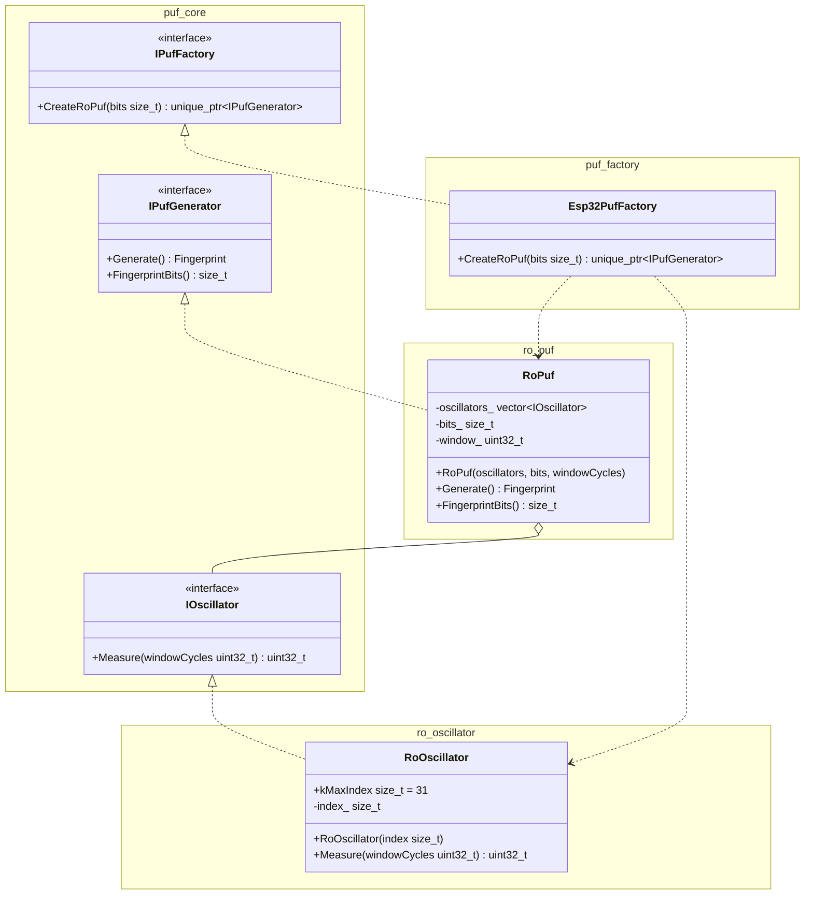

# puf_generator

Аппаратный идентификатор устройства на основе Ring Oscillator PUF для ESP32.  
Генерирует 256-битный отпечаток, уникальный для каждого экземпляра чипа,
на основе вариаций времени выполнения программных осцилляторов в IRAM.

---

## Архитектура



### Компоненты

| Компонент | Зависимости | Описание |
|---|---|---|
| `puf_core` | — | Интерфейсы `IOscillator`, `IPufGenerator`, `IPufFactory`, тип `Fingerprint` |
| `ro_oscillator` | `puf_core` | 32 IRAM-осциллятора для ESP32 (Xtensa LX6) |
| `ro_puf` | `puf_core` | Генератор отпечатка попарным сравнением счётчиков; платформонезависим |
| `puf_factory` | `puf_core`, `ro_oscillator`, `ro_puf` | Фабрика для ESP32: собирает осцилляторы и передаёт в `RoPuf` |

Новый тип устройства — новая фабрика. Новый тип осциллятора — новый компонент рядом с `ro_oscillator`. `RoPuf` работает с любыми `IOscillator` без изменений.

---

## Структура проекта

```
puf_generator/
├── conanfile.py
├── profiles/
│   ├── esp32          # Conan-профиль для кросс-компиляции
│   └── host           # Conan-профиль для хост-тестов
├── components/
│   ├── puf_core/
│   │   ├── fingerprint.hpp
│   │   ├── i_oscillator.hpp
│   │   ├── i_puf_generator.hpp
│   │   ├── CMakeLists.txt
│   │   └── test/
│   ├── ro_oscillator/
│   │   ├── ro_oscillator.hpp
│   │   ├── CMakeLists.txt
│   │   ├── test/
│   │   └── src/
│   │       └── ro_oscillator.cpp
│   ├── ro_puf/
│   │   ├── ro_puf.hpp
│   │   ├── CMakeLists.txt
│   │   ├── test/
│   │   └── src/
│   │       └── ro_puf.cpp
│   └── puf_factory/
│       ├── ipuf_factory.hpp
│       ├── esp32_puf_factory.hpp
│       ├── CMakeLists.txt
│       ├── test/
│       └── src/
│           └── esp32_puf_factory.cpp
└── main/
    ├── main.cpp
    └── CMakeLists.txt
```

---

## Требования

- [ESP-IDF](https://docs.espressif.com/projects/esp-idf/en/latest/esp32/get-started/) v5.x
- [Conan](https://conan.io/) 2.x (`pip install conan`)
- CMake 3.16+

---

## Сборка

### ESP32

```bash
# Активировать ESP-IDF окружение
. ~/esp/esp-idf/export.sh

idf.py set-target esp32
idf.py build
idf.py -p /dev/ttyUSB0 flash monitor
```

### Хост-тесты (через Conan)

```bash
# Сгенерировать хост-профиль (один раз)
conan profile detect --name host

# Установить зависимости и настроить сборку
conan install . --output-folder=build_host --build=missing -pr=profiles/host

# Собрать и запустить тесты
cmake -B build_host -DCMAKE_TOOLCHAIN_FILE=build_host/conan_toolchain.cmake
cmake --build build_host
ctest --test-dir build_host --output-on-failure
```

### Добавить зависимость

В `conanfile.py` в метод `requirements()`:

```python
def requirements(self):
    if self.settings.os != "baremetal":
        self.requires("gtest/1.14.0")
    # ESP32 и хост:
    self.requires("nlohmann_json/3.11.3")
```

> Большинство Conan-пакетов не поддерживают `os=baremetal`. Для ESP32-специфичных библиотек используй [IDF Component Registry](https://components.espressif.com/).

---

## Использование

```cpp
#include <esp32_puf_factory.hpp>

puf::Esp32PufFactory factory;
const auto generator = factory.CreateRoPuf(256);
const puf::Fingerprint fp = generator->Generate();

// fp — std::vector<uint8_t>, 32 байта (256 бит)
```

### Принцип генерации отпечатка

1. `Esp32PufFactory` создаёт 23 экземпляра `RoOscillator` (23×22/2 = 253 пары ≥ 256 бит с запасом; под 256 бит используются первые 256 пар).
2. `RoPuf::Generate()` запускает каждый осциллятор на `200 000` тактов и фиксирует число итераций.
3. Для каждой пары `(i, j)`: `counts[i] > counts[j]` → бит `1`, иначе `0`.
4. Результат — 32 байта, уникальных для данного экземпляра чипа.

---

## Метрики оценки

| Метрика | Описание |
|---|---|
| Intra-HD | Расстояние Хэмминга между повторными измерениями одного устройства (цель: < 5%) |
| Inter-HD | Расстояние между отпечатками разных устройств (цель: ≈ 50%) |
| Энтропия | Степень случайности идентификатора (цель: близко к 1 бит/бит) |
