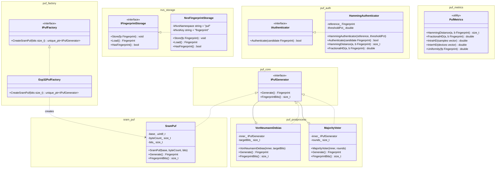

# Архитектура

## Компоненты

| Компонент | Зависимости | Описание |
|---|---|---|
| `puf_core` | — | Интерфейс `IPufGenerator`, тип `Fingerprint` |
| `sram_puf` | `puf_core` | Генератор отпечатка по начальному состоянию SRAM; платформонезависим |
| `puf_factory` | `puf_core`, `sram_puf` | Интерфейс `IPufFactory` и реализация `Esp32PufFactory` |
| `nvs_storage` | `puf_core` | Хранение эталонного отпечатка в ESP32 NVS |
| `puf_auth` | `puf_core` | Аутентификация по расстоянию Хэмминга с настраиваемым порогом |
| `puf_postprocess` | `puf_core` | Декораторы `VonNeumannDebias` и `MajorityVoter` для повышения качества |
| `puf_metrics` | `puf_core` | Метрики оценки PUF: intra-HD, inter-HD, uniformity |
| `puf_log` | `esp_common`, `freertos` | Кольцевой буфер логов; дамп по UART-команде `LOGS` |

Новый тип устройства — новая фабрика. Новый источник энтропии — новый компонент рядом с `sram_puf`, метод `Create*` в `IPufFactory`. Постобработка подключается декораторами без изменения генератора.
